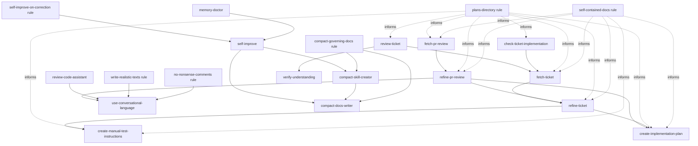

# agent-toolkit

A collection of generic agentic tools for common engineering tasks, designed to work with any AI
agent on any kind of software project.

## Skills

Agentic skills for everyday software engineering — solo or in a team, not bound to any specific
language or framework.

### Skill & doc authoring

Tools to create and continuously improve the skills and docs your agents rely on, following
[this approach to agentic skills](https://medium.com/engineering-in-the-age-of-ai/my-approach-to-agentic-skills-e08dc6c0d1cd).

- **[compact-docs-writer](./skills/compact-docs-writer/SKILL.md)** — write docs with maximum token
  economy.
- **[compact-skill-creator](./skills/compact-skill-creator/SKILL.md)** — create or edit skills,
  keeping them lean and efficient.
- **[self-improve](./skills/self-improve/SKILL.md)** — capture a lesson into the skill or doc that
  governs it, so mistakes aren't repeated and agents keep getting better at the project.

### Context & memory hygiene

Maintenance to run from time to time, keeping your setup tidy and your context sharp.

- **[context-checkup](./skills/context-checkup/SKILL.md)** — audit what auto-loads into a
  session's context and spot what can be trimmed to reduce startup tokens.
  [Why this is important](https://medium.com/engineering-in-the-age-of-ai/keep-your-ai-agents-context-window-sharp-7255d83a8949).
- **[memory-doctor](./skills/memory-doctor/SKILL.md)** — clean up the memory your agents keep
  auto-accumulating, moving the relevant parts to the right place.
  [More about this](https://medium.com/engineering-in-the-age-of-ai/keep-your-ai-agents-memory-clean-and-organized-with-memory-doctor-a79f7174f257).

### Task workflow

A daily routine for any programming task, following the
[RPA workflow](https://medium.com/engineering-in-the-age-of-ai/the-refine-plan-act-pattern-for-agentic-ai-coding-59ee013e4427):
fetch a ticket, refine it, plan it, then let a fresh session execute it.

- **[fetch-ticket](./skills/fetch-ticket/SKILL.md)** — download a ticket from any tracker
  (e.g. GitHub, Jira, Azure DevOps) and save it as a self-contained markdown file.
- **[refine-ticket](./skills/refine-ticket/SKILL.md)** — define the "what" of a task: validate the
  ticket — or a raw idea you want to brainstorm — against the codebase, settle open decisions
  together, and save a self-contained requirements doc a fresh session can pick up.
- **[create-implementation-plan](./skills/create-implementation-plan/SKILL.md)** — define the
  "how" of a task: turn the requirements into an implementation plan, settling the technical
  decisions together, then save it for a fresh session to execute.
- **[create-manual-test-instructions](./skills/create-manual-test-instructions/SKILL.md)** —
  derive manual test steps from a ticket or requirements file, useful for the developer or QA.

### Review assistants

Review helpers that check the codebase while assisting with code or ticket reviews.

- **[fetch-pr-review](./skills/fetch-pr-review/SKILL.md)** — collect the comments left by other
  reviewers on your PR and save them into a markdown doc, ready to address (or push back on), for
  example via refine-pr-review.
- **[refine-pr-review](./skills/refine-pr-review/SKILL.md)** — go through a fetched PR review
  together, comment by comment — address, partial, or push back — drafting the replies and
  turning the accepted changes into a requirements doc.
- **[review-code-assistant](./skills/review-code-assistant/SKILL.md)** — assist you in reviewing a
  PR or branch.
- **[use-conversational-language](./skills/use-conversational-language/SKILL.md)** — the voice for
  text that should read as if a person typed it, used by the review skills for comments and
  replies and by rules for user-facing texts and code comments.
- **[review-ticket](./skills/review-ticket/SKILL.md)** — triage a ticket or ticket set before
  anyone picks it up, saving a review with a feature walkthrough and the decisions to raise with
  the team.
- **[verify-understanding](./skills/verify-understanding/SKILL.md)** — explain the feature back
  in your own words before building it: a teach-back conversation over a saved ticket review that
  probes and corrects until you are ready to implement.
- **[check-ticket-implementation](./skills/check-ticket-implementation/SKILL.md)** — check how
  much of a ticket is already implemented in the code, marking each requirement as done, partial,
  or not done in a human-readable status report.
- **[fresh-eyes-review](./skills/fresh-eyes-review/SKILL.md)** — let an agent with a fresh
  perspective review a changeset and report its findings back to the main session.

### Code checks

- **[run-nx-checks](./skills/run-nx-checks/SKILL.md)** — run format, lint, test, and build on the
  affected projects of an Nx workspace and fix unambiguous failures.

### How to install the skills

Install all skills in one command:

```sh
git clone https://github.com/eai-org/agent-toolkit.git && cd agent-toolkit && ./install.sh
```

Update in one command:

```sh
cd agent-toolkit && git pull && ./install.sh
```

How the symlink install works and the other install methods — hand-picking skills, other agents,
[skills.sh](https://skills.sh/), the Claude Code plugin marketplace — are covered in
[docs/install-skills.md](./docs/install-skills.md).

## Rules

A set of generic, project-agnostic, opinionated rules that apply to any codebase. They are opt-in,
installed separately from the skills.

- **[compact-governing-docs](./rules/compact-governing-docs.md)** — run the matching compaction
  skill before writing or editing a governing doc, so it stays compact.
- **[git-read-only-by-default](./rules/git-read-only-by-default.md)** — never commit, push, merge,
  or otherwise write to git without an explicit instruction.
- **[no-ai-attribution](./rules/no-ai-attribution.md)** — no AI co-author trailers on commits and
  no "Generated with" footers on PRs.
- **[no-nonsense-comments](./rules/no-nonsense-comments.md)** — write only code comments that
  still make sense to a future reader with zero context, prefer no comment over a low-value one,
  and voice them via [use-conversational-language](./skills/use-conversational-language/SKILL.md).
- **[plans-directory](./rules/plans-directory.md)** — save plans and similar documents under the
  project's planning directory, following a certain structure.
- **[read-other-repos-governing-docs](./rules/read-other-repos-governing-docs.md)** — before
  editing another repo's files, read and follow that repo's governing docs — they don't auto-load.
- **[self-contained-docs](./rules/self-contained-docs.md)** — keep planning and design docs
  concise and executable by a fresh session with no prior context.
- **[self-improve-on-correction](./rules/self-improve-on-correction.md)** — when the user corrects
  something a skill or doc governs, offer to persist the lesson via
  [self-improve](./skills/self-improve/SKILL.md).
- **[write-realistic-texts](./rules/write-realistic-texts.md)** — make user-facing text sound
  natural, no AI-generated nonsense.

### How to install the rules

The rules are always-on behavior policies — they change how the agent works on every task
(e.g. `git-read-only-by-default`), so they are never installed implicitly. To opt in:

```sh
./install-opinionated-rules.sh
```

Auto-loaded rule directories are mostly a Claude Code feature; agents without one take a single
global `AGENTS.md` instead, so only the skills apply to them.

How rules work, the script's options, and linking individual rules by hand are covered in
[docs/install-rules.md](./docs/install-rules.md).

## Install with agentwheel

[agentwheel](https://github.com/NestDevLab/agentwheel) installs this repo's rules **and** skills
into your agent and keeps them in sync across Claude, Codex, Copilot, and other runtimes, from
one source. Run it from where you want it installed (`~` for user level, or a project root):

```sh
npx agentwheel install github:eai-org/agent-toolkit --adapter claude
```

Other adapters, selecting individual pieces, and the OpenPack manifest are covered in
[docs/install-with-agentwheel.md](./docs/install-with-agentwheel.md).

## Artifact relationships

Some skills and rules form a workflow or rely on each other. Hard dependencies are encoded in
[`openpack.json`](openpack.json); suggested next steps live in the skill text.


